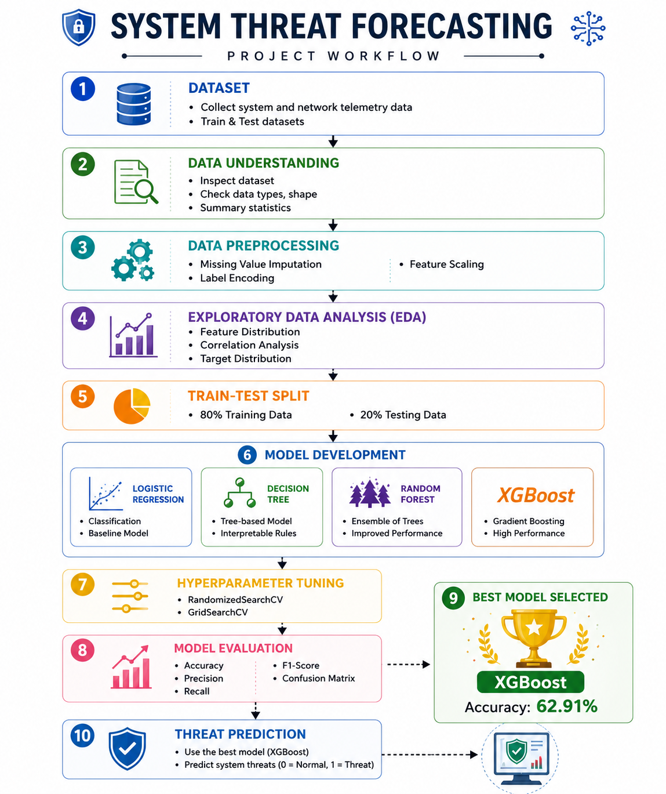
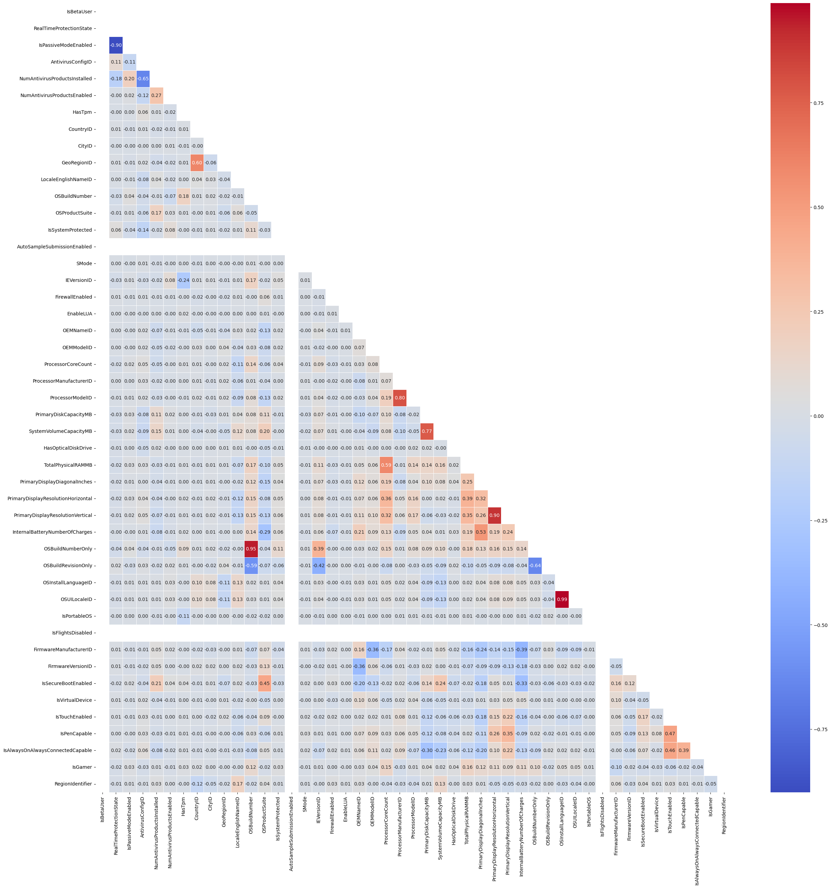
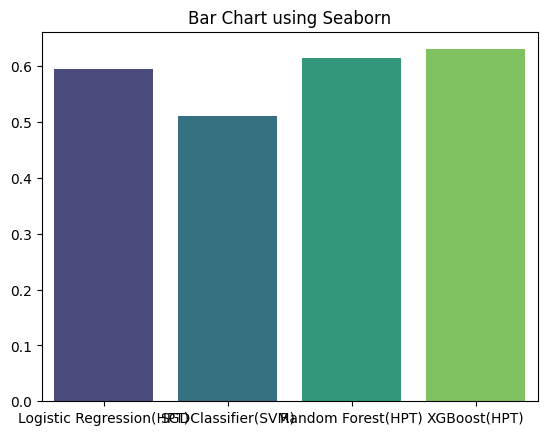
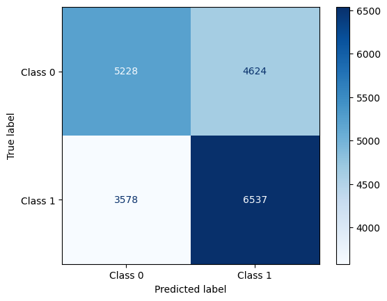
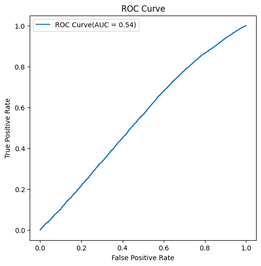

# 🛡️ System Threat Forecasting using Machine Learning

<p align="center">
  
</p>

<p align="center">
  
  
  
  
  
</p>

---

# 📌 Project Overview

System Threat Forecasting is a machine learning classification project that predicts whether a system is likely to be under threat based on system telemetry data.

The project demonstrates a complete machine learning workflow including:

- Data preprocessing
- Exploratory Data Analysis (EDA)
- Feature engineering
- Model training
- Hyperparameter tuning
- Model evaluation
- Threat prediction

---

# 🎯 Objectives

- Predict potential system threats using machine learning.
- Compare multiple classification algorithms.
- Identify the best-performing model.
- Improve prediction accuracy using hyperparameter tuning.
- Build an end-to-end machine learning pipeline.

---

# 📂 Repository Structure

```
system-threat-forecasting/
│
├── data/
│   ├── train_sample.csv
│   └── test_sample.csv
│
├── notebooks/
│   └── Notebook-CodeWork.ipynb
│
├── images/
│   ├── workflow.png
│   ├── feature_importance.png
│   ├── confusion_matrix.png
│   ├── model_comparison.png
│   └── roc_curve.png
│
├── requirements.txt
├── README.md
└── LICENSE
```

---

# 🔄 Project Workflow

<p align="center">

</p>

The workflow consists of:

1. Dataset Collection
2. Data Understanding
3. Data Preprocessing
4. Exploratory Data Analysis
5. Train-Test Split
6. Model Development
7. Hyperparameter Tuning
8. Model Evaluation
9. Best Model Selection
10. Threat Prediction

---

# 📊 Dataset

The original dataset is large and cannot be uploaded to GitHub due to size limitations.

A sample dataset is included for demonstration purposes.

---

# 🧹 Data Preprocessing

The following preprocessing techniques were applied:

- Missing Value Imputation
- Label Encoding
- Feature Scaling

---

# 📈 Exploratory Data Analysis

EDA was performed to understand:

- Data distribution
- Missing values
- Correlation between features
- Target class distribution

---

# 🤖 Machine Learning Models

The following machine learning models were implemented and evaluated:

- Logistic Regression
- Decision Tree
- Random Forest
- XGBoost

---

# ⚙️ Hyperparameter Tuning

To improve model performance, hyperparameter tuning was performed using:

- RandomizedSearchCV
- GridSearchCV

---

# 📊 Model Evaluation

Models were evaluated using:

- Accuracy
- Precision
- Recall
- F1-Score
- Confusion Matrix

---

# 🏆 Best Model

| Model | Accuracy |
|--------|----------:|
| Logistic Regression | 59.44% |
| Decision Tree | 51.08 |
| Random Forest | 61.47 |
| **XGBoost** | **62.91%** |

### Why XGBoost?

- Highest accuracy among all tested models.
- Robust ensemble learning algorithm.
- Handles high-dimensional data efficiently.
- Excellent performance on structured tabular datasets.

---

# 📸 Results

## Workflow

<p align="center">

</p>

## Correlation Heatmap

<p align="center">

</p>

## Model Comparison

<p align="center">

</p>

## Confusion Matrix

<p align="center">

</p>

## ROC Curve

<p align="center">

</p>

---

# 💼 Business Impact

Early identification of potential system threats enables organizations to:

- Detect malicious activities proactively.
- Reduce cybersecurity risks.
- Improve incident response time.
- Prioritize high-risk systems.
- Enhance overall system security.

---

# 🚀 Future Scope

- Real-time threat prediction
- Flask/FastAPI deployment
- Cloud deployment
- Docker containerization
- Interactive dashboard using Power BI
- Deep learning-based threat detection

---

# 🛠️ Technologies Used

- Python
- Pandas
- NumPy
- Matplotlib
- Seaborn
- Scikit-learn
- XGBoost
- Google Colab

---

# 👩‍💻 Author

**Nihila Pallath**

🎓 BS in Data Science and Programming  
**Indian Institute of Technology Madras**

📧 Email: *nihilapallath444@gmail.com*  
🔗 GitHub: https://github.com/NihilaPallath-ds

---

# ⭐ Support

If you found this project useful, please consider giving it a ⭐ on GitHub.
